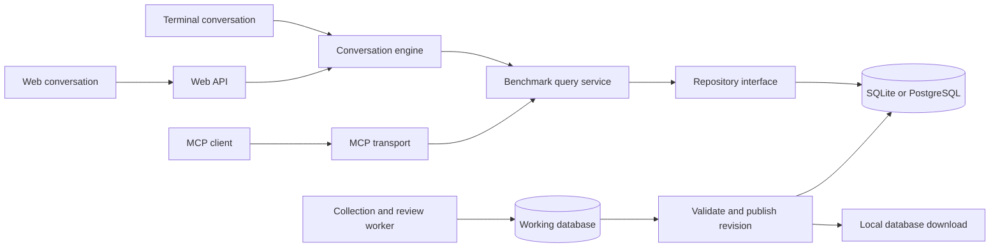

# Bench2Agent database and web service design

Bench2Agent will serve terminal conversations, MCP clients and a hosted web
conversation through the same benchmark tools. A relational database will hold
papers, benchmark identities, stated uses and their evidence. Collection runs
will add or revise records; agents will query a published data revision.

This is the implementation design. The current application still reads the
JSON benchmark snapshot, and `bench2agent serve` starts the local browser
prototype. The database adapters and hosted service are the next development
stages. This design supports a future Mac server and Linux deployment.

## Shared tools and separate interfaces

The query service owns benchmark identity, scope, counting, adoption and
evidence rules. Its responses retain the current six tool names and argument
schemas. An agent chooses tools and explains returned results; Python and SQL
compute the figures. The model does not receive unrestricted SQL access.

The repository interface supplies scoped paper observations, benchmark facts,
introduction claims and evidence. JSON and SQLite adapters first implement
the same contract. A PostgreSQL adapter follows when server write concurrency
requires it. Counts and statistical comparisons share one implementation;
backend-specific retrieval and aggregation must pass the same reference cases.

Both local and hosted answers carry the dataset revision, complete tool
arguments, analysed editions, denominators and evidence IDs. Every tool call
in a conversation uses its pinned revision, including follow-up questions and
answer verification. A new revision becomes available to new conversations;
existing conversations continue on their original revision.

## Database choices

| Deployment | Initial storage | Conditions for expansion |
|---|---|---|
| Installed terminal or local MCP | Read-only SQLite data bundle; local conversation files | No database server or additional runtime dependency |
| First hosted service on one Mac or Linux machine | SQLite research data; separate application store for users, sessions and jobs | Read-heavy research queries and a single publishing worker |
| Multiple collection writers or application servers | PostgreSQL for central metadata and application state; SQLite exports for local users | Concurrent writes, shared job coordination or several service instances |

The current corpus does not require PostgreSQL solely because it contains
tens of thousands of papers. SQLite supports local application storage and
server-side querying; many simultaneous writers are a reason to use a
client/server database. Keep SQLite files on local storage rather than a
network share. See [SQLite's deployment guidance](https://www.sqlite.org/whentouse.html).

Schema migrations and repository contracts must support both engines.
The terminal keeps its standard-library SQLite adapter. PostgreSQL drivers and
the web framework belong to optional server dependencies. Benchmark identity
and counting logic must not depend on a particular engine.

## Records and relationships

| Record | Essential fields and relationships |
|---|---|
| `papers` and `paper_identifiers` | Stable paper ID; title; external ID namespace and value, including arXiv, DOI, OpenReview and Anthology IDs; source-backed identity resolution |
| `paper_versions` | Paper ID, exact source version, URL, document hash, collection date, parser version and parsed artifact reference |
| `editions` and `paper_editions` | Venue, year, track, proceedings URL, edition dates when known, paper membership and source record ID |
| `paper_authors` | Original author spelling, order, normalization method; verified external identifiers when available; missing identity remains explicit |
| `benchmarks`, `benchmark_aliases` and `benchmark_relations` | Existing stable benchmark IDs, published names, sourced aliases, kind, settings, versions, homonyms and derived/subset relationships |
| `benchmark_uses` | Paper-version and observation scope, benchmark ID, evaluation/training role, resolution status, extraction/review run and supporting evidence links |
| `introduction_claims` and `reviews` | Claim ID, paper, benchmark, claim type, candidate/confirmed/excluded status, review method, rubric version and reason |
| `evidence` and `use_evidence` | Verbatim text or assembled table record, section/table location, source version, source hash, attached references and source offsets when available |
| `paper_labels` | Multiple domain/task labels, original label, declared or derived origin, vocabulary and classifier version |
| `resources` and `resource_checks` | Benchmark/paper owner, URL, host, artifact kind, paper-owned release versus maintained mapping, revision, check method, outcome and date |
| `ingestion_runs` and `paper_processing` | Stage, source, software/rule version, time, per-paper status, failure reason and retry state |
| `dataset_revisions` | Schema version, included extraction/review runs, creation date, content checksum and publication status |

A paper and its membership in a conference are separate records. One paper
can appear in multiple editions. Usage counts preserve paper-edition
observations; adoption counts deduplicate the stable paper identity as the
current tools do. Introduction dates distinguish first reviewed claim in this
corpus from independently established public release dates.

Names are not unique keys. Two products with the same name retain separate
benchmark IDs and introduction papers. Existing resolution decisions and
unattributed mentions survive import. Benchmark versions and settings remain
separate identities where the project's current identity rules require it.

Deduplicated evidence can support several uses through `use_evidence`.
The use relationship is stored independently of the displayed text. Removing
a duplicate quote or changing display limits must not remove the underlying
paper-benchmark-role relationship.

Collection retains all accepted paper records, including those without
arXiv matches or parsed text. Denominators come from processing status within
the requested scope. Importing the present snapshot preserves its aggregate
coverage and parsed observations; it cannot reconstruct missing papers or
source versions that the snapshot never recorded. Such fields remain unknown
until recovered from source records.

## Metadata for benchmark selection

After parity with existing counts is established, add sourced metadata for:

- The evaluation task, input/output formats, modalities and languages.
- Dataset size, answer/label format, official configurations and splits.
- Exact release revision, paper-specific subsets and preprocessing.
- Evaluation metrics, protocol, evaluation script and documented settings.

Each value includes its source and evidence. Prioritize recurring benchmarks
and reviewed introductions; report metadata coverage rather than treating
missing values as negative facts. Public repository access does not establish
that the exact evaluation records are downloadable.

Lexical search can use SQLite FTS5 or the server's search adapter. Semantic
retrieval can later return candidate paper IDs for an explicit research scope.
Counts are computed over that recorded scope; vector retrieval alone does not
establish benchmark use. Declared labels and derived task labels remain
distinguishable.

## Incremental collection and publication

1. Collect a venue edition through its source adapter, retaining source IDs,
   collection time, membership and collection coverage.
2. Resolve paper identities and versions. Queue missing or changed sources;
   transient fetch failures remain retryable rather than recorded as absence.
3. Parse and extract roles, claims and resource links. Store run versions and
   raw candidates separately from confirmed benchmark relationships.
4. Review new identities and ambiguous claims. Reprocess affected documents
   when a registry or rule update can change matches; adding an edition alone
   need not force a complete corpus rerun.
5. Validate counts, denominators, attribution and evidence. Publish one
   immutable revision atomically, then export its local SQLite bundle.

The working database can change while a published revision stays fixed.
Publication must prevent an answer from mixing partially imported editions or
different review revisions. Previous published data remains addressable for
saved conversations and regression checks.

## Hosted conversations

Use a separate ASGI web API, initially FastAPI with Uvicorn, for authenticated
conversations and streamed tool/answer events. It calls the same provider
adapters, tools and verifier as the terminal. Server dependencies are optional;
terminal users do not install the web stack. The existing local HTTP server
remains the paper evidence prototype during this transition.

The hosted application gives each user their own conversations, settings,
request quotas and jobs. Model credentials are supplied to a request-scoped
provider client rather than written to process-global environment variables.
Provider access and billing can use per-user API credentials or a
quota-controlled service account. Persisting user credentials requires an
explicit product decision; request logs and conversation exports exclude them.

The public web route does not spawn the operator's signed-in coding CLI.
Local CLI login shortcuts stay local. Administrative collection and mutation
endpoints are separated from the read-only research tools. The first hosted
beta needs authentication, ownership checks, cancellation and bounded model
requests before public access.

A long-running ingestion worker runs independently of HTTP requests and model
conversations. A database-backed job queue is enough initially; a separate
queue service is added only if load requires it. Tool responses are paginated,
and aggregate caches include the dataset revision and scope arguments.

## Future Mac server

The Mac can host the API, query database, collection worker and web frontend.
When model inference uses provider APIs, these services do not require a local
GPU. Local model inference would be a separate capacity decision.

Use the same application on macOS or in a Linux virtual machine/container.
Container images must support the machine's CPU architecture; deployment
configuration must not hardcode Linux-only process management. Native macOS
services need a startup/restart supervisor; a container setup needs its runtime
to start after reboot. [Docker's Mac installation guide](https://docs.docker.com/desktop/setup/install/mac-install/)
describes the supported Mac distributions.

Place HTTPS termination in a reverse proxy such as Caddy, with only the web
application exposed. Keep database and worker endpoints internal. Public
reachability requires a domain and suitable routing or a tunnel, depending on
the network. [FastAPI's deployment concepts](https://fastapi.tiangolo.com/deployment/concepts/)
cover startup, restarts, process memory and HTTPS termination;
[Caddy](https://caddyserver.com/docs/automatic-https) documents certificate handling.

Store data on persistent local volumes and keep backups outside the serving
machine. Test restoring both research revisions and application state. SQLite
backups use its backup mechanism or frozen published files; PostgreSQL offers
[dump and continuous-archive options](https://www.postgresql.org/docs/current/backup.html).
Collection and model-call logs remain distinct from user-visible evidence.

## Implementation sequence

1. Import the present JSON snapshot into normalized SQLite tables without
   losing existing IDs, claims, evidence, unresolved mentions or coverage.
2. Add the repository interface and SQLite adapter; compare every existing
   tool result against the JSON implementation, including homonyms, unknown
   authors, zero adoption and duplicate paper membership.
3. Add incremental edition ingestion and immutable data revisions. Verify
   rollback, repeat imports and saved-answer reproducibility.
4. Build the hosted conversation API and browser shell, with isolated user
   sessions and provider clients. Run the same representative question suite
   through terminal, MCP and HTTP.
5. Prepare Mac/Linux deployment and restore tests. Add PostgreSQL when measured
   write concurrency or multiple service instances justify it.

Paper2Agent informs the separation of executable tools, data resources and
workflow instructions. Bench2Agent applies that principle to benchmark
discovery across papers. Executing a selected benchmark's evaluation pipeline
is a later extension, with source revisions, input/output contracts and
reference-result tests per adapter. See the
[Paper2Agent paper](https://arxiv.org/abs/2509.06917v2).
